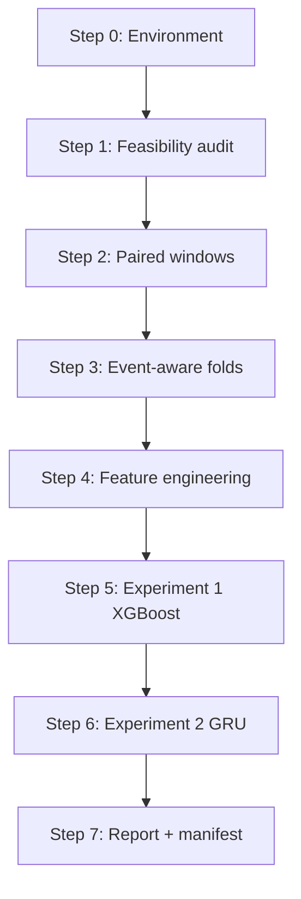

# Glucose Gap: What Is Lost Between Glucose Checks?

### Predicting Hypoglycemia from Continuous and Intermittent Glucose Observations

**Self-learning tutorial (course assignment).** This document teaches peers how to rebuild the Glucose Gap codebase. The project itself is the ML/DL pipeline in `feasibility_audit/` and `modeling/`.

**Story:** Diabetes management is continuous decision-making between meals, insulin, and glucose checks. Continuous sensors see glucose history all the time; intermittent checking only gives snapshots. This tutorial turns that question, *what happens between checks?*, into a reproducible ML/DL pipeline: predict near-term hypoglycemia and measure what is lost when a model sees only intermittent scans instead of continuous CGM history.

| Assignment part | Where it lives |
|-----------------|----------------|
| Python tutorial with detailed comments | `feasibility_audit/data_audit.py`, `modeling/*.py` (module docstrings + inline comments) |
| Step-by-step presentation | [`PRESENTATION.md`](PRESENTATION.md) (import to Google Slides or PowerPoint) |
| Replicability evaluation | [§6 below](#6-replicability-evaluation) + `run_manifest.json` |
| Healthcare ML/DL analysis | HUPA-UCM FreeStyle CGM + scans; XGBoost + optional GRU |

## 1. Learning goal

**Question:** How much near-term hypoglycemia prediction performance is lost when a model sees only intermittent user-initiated scans instead of continuous CGM history?

**Why it matters:** Real-world diabetes tools often have gaps between measurements. Before deploying an alert system, we need to know whether sparse observations are *good enough* or whether continuous streaming data is essential.

**Conceptual framing (important):** Scans are not a separate biological modality. They are intermittent views of the *same* FreeStyle sensor signal. We compare **continuous access** vs **intermittent access**, not CGM vs finger sticks.

## 2. Dataset and cohort

- **Source:** HUPA-UCM Diabetes Dataset (`HUPA-UCM Diabetes Dataset/`)
- **Streams per participant:** continuous CGM slots + user-initiated scans (same sensor family)
- **Primary cohort:** 22 participants with both dense CGM and scan activity (HUPA0015P excluded for scan sparsity)
- **Locked design:** documented in [`feasibility_audit/feasibility_report.md`](../feasibility_audit/feasibility_report.md) §11

| Parameter | Value | Rationale |
|-----------|-------|-----------|
| Dense history | 4 h @ 15 min (16 slots) | Standard CGM context window |
| Sparse history | 6 h of scans | Longer lookback because scans are sparse |
| Prediction horizon | 2 h | Clinically actionable lead time |
| Window stride | 30 min | Balances sample size vs autocorrelation |
| Outcome | Any glucose < 70 mg/dL in horizon | Standard hypoglycemia threshold |
| Missingness cap | ≤20% in input + label windows | Avoid windows dominated by gaps |
| CV | Grouped 5-fold by participant | Prevents same person in train and test |
| Primary metric | AUPRC | Appropriate for ~15% positive rate |
| Random seed | 42 | Fixed in `modeling/reproducibility.py` |

## 3. Tutorial pipeline (rebuild order)

Follow this order when teaching or reproducing. Each step writes inspectable CSV/JSON artifacts.



### Step 0: Environment

```bash
cd "glucose-gap"
python3 -m venv .venv && source .venv/bin/activate
pip install -r requirements.txt
# macOS only:
brew install libomp
```

### Step 1: Feasibility audit (`feasibility_audit/data_audit.py`)

**Teaches:** data inventory, leakage checks, episode concentration, window eligibility.

```bash
python feasibility_audit/data_audit.py
```

**Read next:** `feasibility_audit/feasibility_report.md` (locked experimental design).

**Key audit outputs:** participant inventories, stride sensitivity, high-participant episode audit (HUPA0027P/HUPA0028P dominate positives).

### Step 2: Paired prediction windows (`modeling/windows.py`)

**Teaches:** horizon-safe labeling, identical timestamps for dense and sparse models.

For each participant, the code walks a 30-minute grid. A window is eligible when:

1. Input window (4 h before `prediction_time`) has ≤20% missing CGM slots
2. Label window (2 h after `prediction_time`) has ≤20% missing slots
3. Label = 1 if *any* CGM value in the horizon is < 70 mg/dL

**Output:** `modeling_outputs/paired_windows.csv` with canonical fields `target_hypo_2h`, `has_prior_scan`, `scan_count_6h`.

### Step 3: Event-aware cross-validation (`modeling/cv_splits.py`)

**Teaches:** grouped CV and why participant-level folds matter in longitudinal health data.

Folds are assigned **once** from participant summaries (positive windows, total windows, episode count) and saved to `fold_assignments.csv`. Every model reuses this file: dense XGBoost, sparse XGBoost, GRU, and sensitivities all see identical held-out participants.

### Step 4: Feature engineering (`modeling/features.py`)

**Teaches:** leakage prevention. All features use observations **strictly before** `prediction_time`.

| Arm | Features | Examples |
|-----|----------|----------|
| Dense (tabular) | 4 h CGM slots | mean, median, min, slopes at 15/30/60/120 min, proportion below 70/80/90, missing-slot count, cyclic hour |
| Sparse (tabular) | 6 h scans | scan count, time since last scan, scan mean/std, last-two slope |
| Dense (sequence) | 16 × 2 tensor | `[glucose_value, observation_mask]` for GRU |

**Outputs:** `dense_features.csv`, `sparse_features.csv`, `dense_sequences.npz`.

### Step 5: Experiment 1: Dense vs sparse XGBoost (`modeling/train.py`)

**Teaches:** fair paired comparison, class imbalance, threshold tuning without leakage.

Pipeline per fold:

1. Median imputation fit on **training folds only**
2. Inner validation split (20%) on training folds for **F1-optimal threshold**
3. Refit model on full training folds
4. Predict held-out fold, producing out-of-fold (OOF) probabilities

**Primary readout:** pooled AUPRC on OOF predictions + participant-level bootstrap CI on dense-sparse difference (`paired_comparison.csv`).

**Interpretation aid:** SHAP plots in `modeling_outputs/figures/shap_*.png`.

### Step 6: Experiment 2: Dense XGBoost vs GRU (`modeling/gru_model.py`)

**Teaches:** when a small DL sequence model adds little over strong tabular features.

- 1-layer GRU, 32 hidden units, 2-channel input (value + mask)
- Value channel standardized using **training folds only**
- Skips gracefully if PyTorch is not installed

### Step 7: Sensitivities and reporting

| Analysis | Purpose |
|----------|---------|
| Exclude HUPA0027P + HUPA0028P | Test whether two dominant participants drive headline results |
| Sparse strata (has scan / no scan) | Separate windows where sparse features are informative vs empty |

```bash
python -m modeling.train --skip-gru
# Human-readable summary:
cat modeling_outputs/modeling_results.md
```

## 4. Code map (where to read comments)

| File | Tutorial focus |
|------|----------------|
| `feasibility_audit/data_audit.py` | Data understanding, leakage, cohort lock |
| `modeling/config.py` | Single source of truth for hyperparameters |
| `modeling/windows.py` | Window eligibility + paired table |
| `modeling/cv_splits.py` | Event-aware fold balancing |
| `modeling/features.py` | Dense/sparse/sequence features, horizon safety |
| `modeling/metrics.py` | AUPRC, threshold tuning, participant bootstrap |
| `modeling/gru_model.py` | Small GRU with mask channel |
| `modeling/train.py` | Full experiment orchestration |
| `modeling/report.py` | Auto-generated results narrative |

## 5. Expected results

After `python -m modeling.train --skip-gru`, headline numbers for your write-up:

| Metric | Dense XGBoost | Sparse XGBoost |
|--------|--------------:|---------------:|
| AUPRC | 0.659 | 0.127 |
| AUROC | 0.847 | 0.406 |

| Sensitivity | Dense AUPRC | Sparse AUPRC |
|-------------|------------:|-------------:|
| Exclude 27/28 | 0.704 | 0.205 |

**Teaching point:** Even if sparse AUPRC is lower, quantify *how much* is lost (absolute difference, relative %, bootstrap CI). A small gap might justify scan-only deployments; a large gap argues for continuous CGM.

## 6. Replicability evaluation

This section satisfies the assignment requirement to *evaluate tutorial effectiveness for replicability*.

### What makes replication feasible

| Mechanism | Benefit |
|-----------|---------|
| `feasibility_audit/data_audit.py` + `modeling/train.py` | Direct pipeline entry points |
| `modeling/config.py` | All hyperparameters in one file |
| `RANDOM_SEED = 42` | Deterministic splits and model init |
| `fold_assignments.csv` written once | Same CV across all experiments |
| Intermediate CSV/NPZ artifacts | Peers can inspect windows/features without re-running models |
| `run_manifest.json` | Records Python version, platform, package versions, UTC timestamp |
| Module docstrings | Explain *why* each step exists, not just *what* it does |

### Replication checklist for a peer

- [ ] Clone repo; place HUPA-UCM dataset at expected path
- [ ] Create venv; `pip install -r requirements.txt`
- [ ] macOS: install `libomp` if XGBoost fails
- [ ] Run `python feasibility_audit/data_audit.py` then `python -m modeling.train --skip-gru`
- [ ] Verify `paired_windows.csv` has 1,260 rows (22-participant cohort, 30-min stride)
- [ ] Verify `model_metrics.csv` contains `dense_xgb` and `sparse_xgb` rows
- [ ] Compare `run_manifest.json` package versions if metrics differ slightly across machines
- [ ] Optional: run `python -m modeling.train` a second time; `fold_assignments.csv` must be unchanged

### Known limitations (document honestly in presentation)

1. **Small cohort (n=22 participants):** Participant-level bootstrap CIs are wide; external validation is needed.
2. **Episode concentration:** Two participants contribute a large share of positive windows; sensitivity analysis is mandatory.
3. **PyTorch optional:** GRU arm may be skipped; primary ML comparison does not require GPU.
4. **Runtime:** Full audit ~8-9 min; modeling ~10+ min depending on hardware and SHAP.

### Tutorial design choices for different audiences

| Audience | Emphasize |
|----------|-----------|
| Clinicians | Intermittent vs continuous monitoring trade-off; 2 h alert horizon |
| ML students | Grouped CV, leakage-safe features, AUPRC for imbalance, paired comparison |
| Engineers | Artifact layout, manifest, one-command rerun, config-driven pipeline |

## 7. Presentation and peer teaching

Use [`PRESENTATION.md`](PRESENTATION.md) for the 15-slide story arc (personal motivation, audit, paired design, results, replicability). Suggested live demo flow (15-20 min):

1. Show feasibility figure: episode concentration (2 min)
2. Walk one row of `paired_windows.csv`: input window, horizon, label (3 min)
3. Show `model_metrics.csv` dense vs sparse AUPRC (3 min)
4. Open one SHAP plot: what glucose history features matter (3 min)
5. Discuss replicability: `run_manifest.json` + pipeline commands (2 min)
6. Q&A: "Would you trust sparse-only alerts in clinic?" (5 min)

## 8. How this differs from typical course examples

- Uses **HUPA-UCM** (FreeStyle CGM + scans), not MIMIC vitals or ICU mortality
- Compares **continuous vs intermittent access to the same sensor**, not multimodal ICU fusion
- Emphasizes **paired, leakage-safe CV** and **participant-level bootstrap** rather than a single hold-out split
- Includes **feasibility audit** as a first-class tutorial step (often skipped in coursework)

## 9. Submission checklist

- [ ] GitHub repo (or Colab link) with this code
- [ ] `tutorial/TUTORIAL.md` (this file)
- [ ] `tutorial/PRESENTATION.md` exported to Slides/PowerPoint with speaker notes
- [ ] `modeling_outputs/modeling_results.md` generated from a full run
- [ ] Brief reflection: what was hardest to explain? what would you change for novices?
